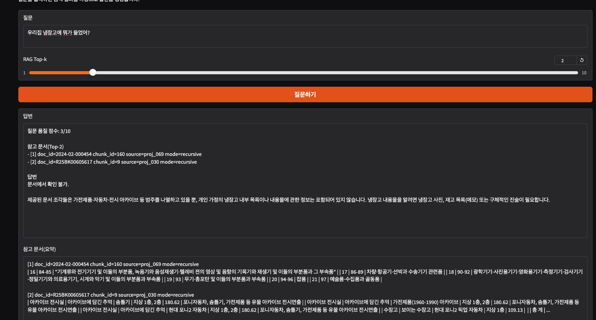
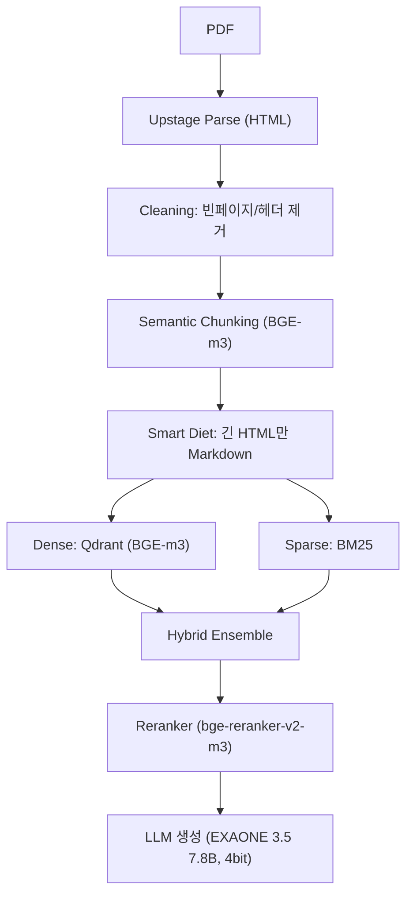

# 📝 2024 연말정산 안내문 기반 RAG Q&A (Korean Tax RAG)

국세청 ‘2024년 귀속 연말정산 신고 안내’ PDF를 근거로 질문에 답하는 RAG(Retrieval-Augmented Generation) 시스템입니다.  
표(세율표/공제표) 같은 2차원 구조가 많은 문서 특성을 고려해, “문서 파싱 품질 + 검색 품질”을 먼저 최적화했습니다.

---

## 📌 이 프로젝트가 해결하려는 문제
세무 PDF는 텍스트만 뽑아내면 검색이 잘 될 것 같지만, 실제로는 아래 때문에 성능이 쉽게 무너집니다.

- 표가 텍스트 덩어리로 뭉개지면 “열/행 의미”가 사라져 숫자 근거 인용이 어려움
- 반복 헤더/푸터는 검색을 교란해서 관련 없는 페이지가 상위로 뜸
- 페이지 자체가 길어서(토큰이 많아서) 단순 chunk_size(예: 512)로 자르면 문맥이 찢어짐

그래서 이 프로젝트는 “모델을 바꾸기 전에 데이터/검색을 먼저 고친다”를 중심 전략으로 잡았습니다.

---

## 파이프라인 한눈에 보기

---

## 최종 파이프라인(요약)
- 로드: Upstage Document Parse (HTML)
- 정제: 빈 페이지 제거 + 헤더/푸터 반복 문구 제거
- 청킹: Semantic Chunking (BAAI/bge-m3 임베딩 기반)
- 최적화: Smart Diet (긴 HTML 청크만 Markdown 변환)
- 검색: Hybrid (BM25 + Dense(Qdrant))
- 재순위: BAAI/bge-reranker-v2-m3
- 생성: LGAI-EXAONE/EXAONE-3.5-7.8B-Instruct (4bit)

---

## 분석 결과(핵심만)
### 1) 로더 비교: PyMuPDF vs Upstage(HTML)
- PyMuPDF는 큰 제목/목차/표 구조가 일부 손실되거나 평탄화됨
- Upstage는 `<table>`, `rowspan/colspan`, `<h1>` 같은 구조가 살아 있어
  “이게 표인지 / 어떤 열이 어떤 의미인지”를 LLM이 이해하기 쉬움
→ 표 중심 세무 문서에서는 HTML 파싱이 품질을 결정한다고 판단했고, 이후 실험은 Upstage로 고정

### 2) 문서 특성: HTML 태그 비중이 큼
- 페이지별 길이를 비교했을 때, HTML은 태그 때문에 글자 수가 크게 증가
- “내용은 적고 태그만 많은 페이지(정보 밀도 낮음)”가 존재
→ 긴 HTML 청크에 대해서만 Markdown 변환(Smart Diet)으로 토큰 낭비를 줄이는 전략 채택

### 3) 청킹: 단순 길이 기반은 위험
- 페이지 토큰 분포가 큰 편이라(중앙값이 높은 편)
  고정 chunk_size로 자르면 대부분 페이지가 2~3등분 → 표/문맥 단절 위험
→ 의미 변화 지점에서 끊는 Semantic Chunking으로 전환

### 4) 검색: 세무 도메인은 Hybrid가 유리
- Dense(의미)만 쓰면 용어 정확도가 아쉬울 수 있고
- Sparse(BM25)만 쓰면 동의어/표현 차이를 놓침
→ BM25 + Dense를 결합(가중치 0.3/0.7)해서 안정적인 상위 후보군 확보

### 5) 재순위: Reranker로 Top-K 정밀도 상승
- Hybrid 검색 후보군에서 “질문 의도와 가장 근접한 페이지”를 재정렬
- 개정 요약 같은 문서가 상단으로 올라오며(“2024년에 바뀐 게 있어?” 같은 의도 반영)
  실제 답변 품질이 체감으로 좋아짐

---

## 실행 방법(Colab 기준)
1. Google Drive에 PDF를 업로드하고 경로를 설정합니다.
2. 노트북에서 필요한 키를 입력합니다.
   - UPSTAGE_API_KEY
   - HF_TOKEN
   - LANGCHAIN_API_KEY

3. 노트북 실행 순서:
- 로드/정제 → 청킹/다이어트 → Qdrant/BM25 인덱싱 → 검색/리랭크 → 생성

---

## 참고
- 문서(국세청 2024 연말정산 신고 안내)는 학습 데이터가 아니라 “검색 근거 문서”로 사용합니다.
- 본 프로젝트는 “근거 기반 답변”을 목표로 하며, 근거가 없으면 추측하지 않도록 프롬프트를 구성했습니다.
